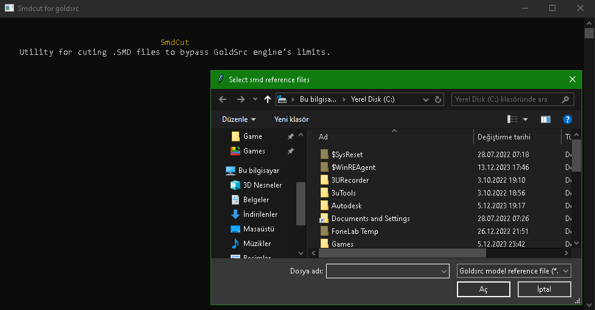
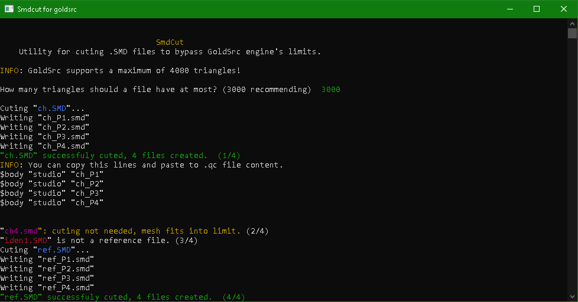
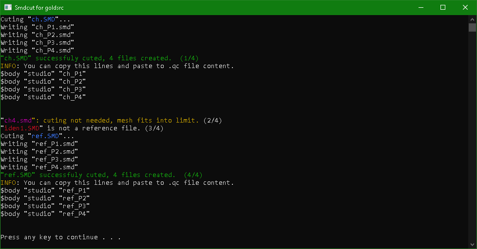

# SmdCut
**Utility for cuting .SMD files to bypass GoldSrc engine's limits.**


```
                                 SmdCut
    Utility for cuting .SMD files to bypass GoldSrc engine's limits.

    Usage: smdcut.exe <file1> <file2> <file3> ...
    Or you can simply drag and drop the files you want to cut into smdcut.exe
```

## Usage

```bash
smdcut.exe <file1> <file2> <file3> ...
```

> [!TIP]
> **Or you can simply drag and drop the files you want to cut into smdcut.exe**

# Screenshots







## License
MIT
